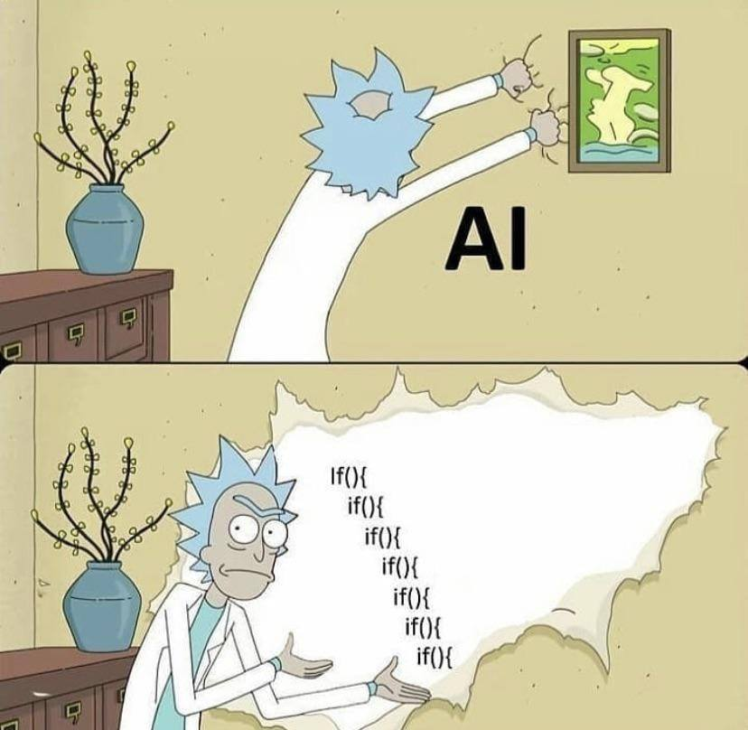

# 
 ☁️ Hi There, I'm Abrilskop ☁️ 

<h4 align="center"><samp> I'm currently the last year student at SENATI and second year student at UAC - Universidad Andina del Cusco.
 My major is Software Engineering and System Engineering. I'm living now in Cusco, Perú.
 I'm interested in coding, researching, drawing and new technologies.
 My quote is "If you can't explain it simply, you don't understand it well enough."
  Check out my Blogs ⬇️  </samp></h4>

    

##  Tech Stack:

 
 
 
 
 
 
 
 
 
 
 
 
 
 
  
 
 	
 
 
 
 

# 
 📊 GitHub Stats: 

    

### 
 ✍️ Random Dev Quote 

### 
 😂 Random Dev Meme 

    

<!-- Thanks for watching -->
